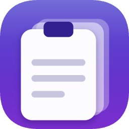
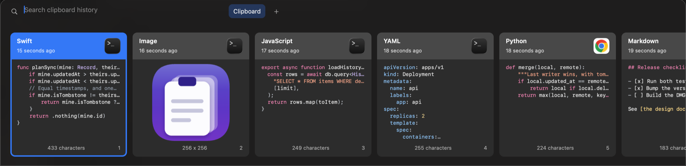
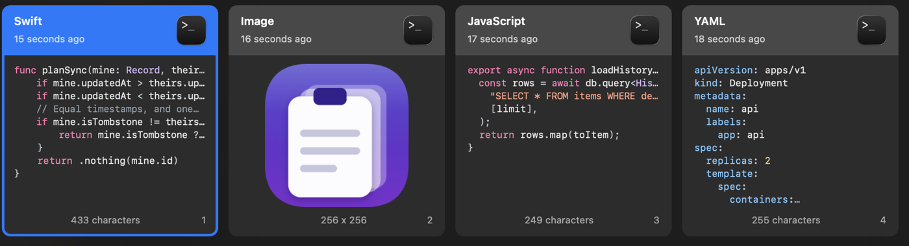
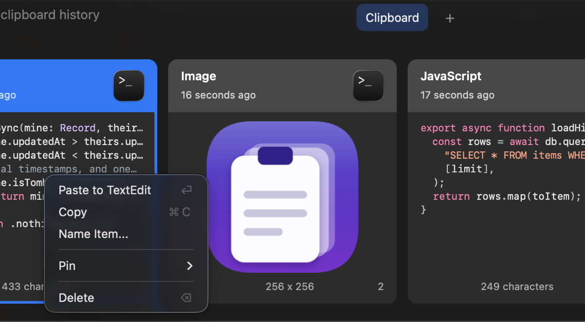

<div align="center">
  
  <h1>Clipd</h1>
</div>

<p align="center">
  Clipd is a clipboard history manager for macOS. It records everything you copy, lets you search all of it, and pastes what you pick straight back into the app you were using.
</p>

<p align="center">
  Copied code keeps its colours. Items can be named, filed into pinboards, and reached with a single shortcut. History is stored in an encrypted database, and it can sync between your own Macs through a Cloudflare R2 bucket that only you hold the key to.
</p>

<p align="center">
  <a href="https://github.com/hengkysandy/clipd/releases"></a>
  
  
  <a href="LICENSE"></a>
</p>

> [!NOTE]
> Clipd is pre-1.0 and started as a personal tool for one person with two MacBooks. It is used every day, and it is tested, but it has not been through many hands yet. Bugs and rough edges are expected. Issues and pull requests are very welcome.

## Install

### Download

Download the latest `Clipd-<version>.dmg` from [Releases](https://github.com/hengkysandy/clipd/releases), open it, and drag `Clipd.app` into your Applications folder.

Clipd is signed with an Apple Development certificate, not a paid Developer ID, so it is **not notarised**. Gatekeeper will refuse to open it on a Mac that did not build it until you clear the quarantine flag once:

```sh
xattr -dr com.apple.quarantine /Applications/Clipd.app
```

Then open Clipd and grant it **Accessibility** in System Settings, Privacy and Security. Pasting is a synthetic Cmd+V, so without that permission Clipd will record your history and paste nothing.

### Build from source

```sh
git clone https://github.com/hengkysandy/clipd.git
cd clipd
brew install xcodegen
./app up
```

`./app up` generates the Xcode project, builds, installs to `/Applications/Clipd.app`, and launches it.

Before the first build, tell the build script which signing identity to use:

```sh
security find-identity -v -p codesigning
echo 'Apple Development: you@example.com (TEAMID)' > .app-signing
```

This is not optional busywork. Under ad-hoc signing the code hash changes on every build, macOS drops the Accessibility permission along with it, and the app then looks perfectly healthy while pasting nothing at all. A real certificate gives a designated requirement made of the bundle identifier and the certificate, with no code hash in it, which survives rebuilds.

Other commands: `./app test` runs both test suites, `./app dmg` builds a release DMG, `./app sig` checks the signature is rebuild-safe, `./app trust` clears a stale Accessibility grant.

## Features and roadmap

### Capture

- [x] Text, links and images, with the source app recorded
- [x] Syntax colouring for copied code, with the language detected automatically
- [x] Swift, TypeScript, JavaScript, Python, Go, Rust, Ruby, Bash, SQL, JSON, YAML and Markdown
- [x] Duplicate copies fold into the existing item instead of piling up
- [x] Retention setting: Day, Week, Month, Year or Forever
- [x] Pause capture for a while, or until you turn it back on
- [ ] Rich text and file paths kept as their own kinds

### The panel and pasting

- [x] Cmd+Shift+V opens the panel over whatever you are using, including fullscreen apps
- [x] Type to search, Enter pastes into the app you came from
- [x] Search matches the item name as well as its content, so you can find a thing by a word that is not in it
- [x] Cmd+1 to Cmd+9 pastes the card wearing that number
- [x] Right click any card to paste, copy, name it, pin it or delete it
- [x] Copy and paste sound effects, or none
- [ ] Paste stack, for collecting several items and pasting them in order
- [ ] Plain text paste mode
- [ ] Link previews
- [ ] Verified on a second display. It has never been tested on one

### Organising

- [x] Name any item, and rename or clear the name later
- [x] Pinboards, with Ctrl+1 to Ctrl+9 to switch between them
- [x] Create a pinboard straight from a card's menu

### Privacy

- [x] Encrypted database (SQLCipher), with the key in the macOS Keychain
- [x] Image payloads encrypted on disk too (AES-GCM), not left beside an encrypted database in the clear
- [x] Honours the `org.nspasteboard.ConcealedType` marker that password managers set
- [x] Deny-list by app, pre-filled with Passwords.app, Keychain Access, Bitwarden and 1Password
- [x] An item is deleted retroactively if the clipboard is wiped soon after it was copied, which is what a password manager does
- [x] "Never record copies from this app" on any captured item
- [x] Erase the whole history from Settings

Apple's Passwords.app sets **no marker at all**. This was measured, not assumed: a real password copy arrives as a 20 byte plain text item with nothing to distinguish it from any other short copy. That is why there are four independent layers rather than one, and why the deny-list ships pre-filled.

### Sync between your own Macs

- [x] Cloudflare R2 as dumb storage, no server to run and no account to create
- [x] End to end encryption with AES-GCM, from a passphrase you set on both Macs
- [x] Last writer wins, with tombstones so a delete on one Mac is not resurrected by the other
- [x] Objects pruned from the bucket when items are deleted
- [x] Sync Now, plus automatic sync in the background
- [ ] Any other backend. There is no backend picker and there will not be one

There is no iCloud option. CloudKit needs a paid Apple Developer membership, and this was built on a free account. R2 has a free tier that comfortably covers a personal clipboard history.

Sync is optional. Clipd works fully offline and stores nothing anywhere until you enter R2 credentials yourself.

### Other

- [x] Menu bar only, no Dock icon and no window on launch
- [x] Open at login
- [ ] Homebrew cask
- [ ] Notarised builds, which need a paid Apple Developer account

## Why macOS 15 and later

Clipd uses Swift 6 with strict concurrency and several newer AppKit and CryptoKit APIs. Supporting older systems would mean carrying compatibility paths for a personal tool that nobody is running on an old Mac. If you need an earlier version and are willing to do the work, open an issue first so we can agree on the cost.

## Gallery

**The panel.** Cmd+Shift+V from anywhere. Type to search, Enter pastes into the app you came from, and Cmd plus the number in the corner of a card pastes that one.



**Copied code keeps its colours.** The language is worked out from the text itself, so nothing has to be tagged by hand.



**Every card has a menu.** Paste, copy, give it a name, pin it to a board, or delete it.



Every item in these screenshots is invented sample content. They were taken with a throwaway instance of the app, which is what `CLIPD_SUPPORT_DIR` is for. See [`ClipdMac/DemoMode.swift`](ClipdMac/DemoMode.swift) if you want to take your own.

## How it is built

```
clipd/
  Sources/ClipdCore/     every decision. No AppKit anywhere.
  Tests/ClipdCoreTests/  swift-testing. No app, no permissions, no simulator.
  ClipdMac/              thin shell that touches macOS
  ClipdMacTests/         XCTest
  app                    one bash script for every command
  docs/design.md         the full design, and what was measured to produce it
```

**The core contains no platform types.** Every question of the form "should this be saved" is answerable by a plain function with no clipboard, no permissions and no running app. That is what makes the privacy rules testable without a password manager present.

The design document in [`docs/design.md`](docs/design.md) records not only what was chosen but what was rejected and why, including the platform assumptions that turned out to be false when they were probed.

## Contributing

Contributions are welcome, from a typo fix to a whole feature.

The short version: open an issue before starting anything large, keep the core free of AppKit, and bring tests for anything that decides what gets stored. [`CONTRIBUTING.md`](CONTRIBUTING.md) has the detail.

If you are reporting a bug, the app's own log is usually more useful than a description:

```sh
/usr/bin/log show --last 5m --info --predicate 'subsystem == "com.hengkysandy.clipd.mac"'
```

Clipd never writes clipboard values to the log, only kinds, sizes and reasons, so it is safe to paste into an issue. Read it before you post anyway.

## Thanks

Clipd is modelled on [Paste](https://pasteapp.io), which is a lovely app and worth paying for. This exists because of a wish for a version that syncs through storage the owner controls.

The README layout follows [Ice](https://github.com/jordanbaird/Ice), which is a good example of explaining a Mac app quickly.

## License

Clipd is available under the [MIT license](LICENSE).
